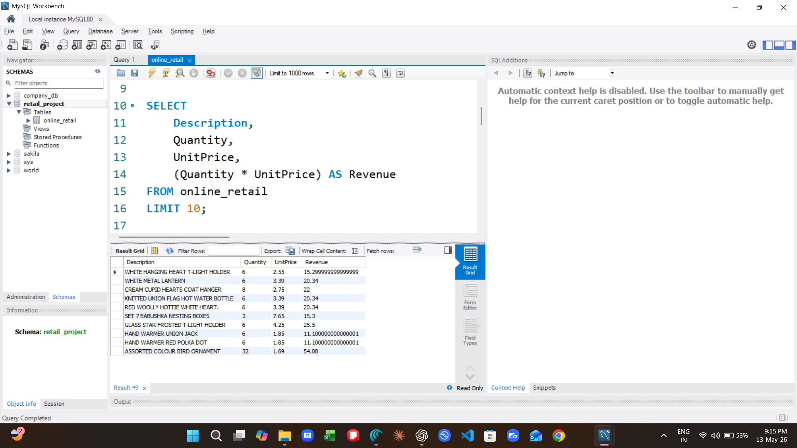
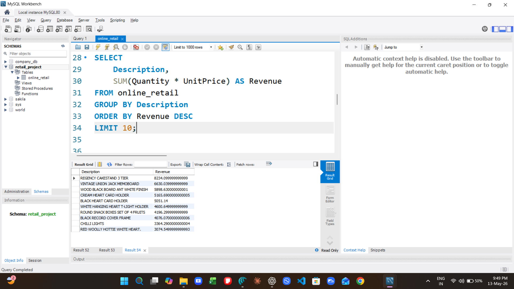

# SQL Retail Sales Analysis

## Project Overview
Analyzed online retail sales data using MySQL to uncover revenue trends, top-selling products, top customers, and country-wise sales performance.

## Skills Used
- SQL
- MySQL Workbench
- Data Cleaning
- Aggregations
- GROUP BY
- ORDER BY
- Revenue Analysis

## Key Insights
- Identified top-selling products
- Found highest revenue-generating countries
- Analyzed top customers
- Calculated revenue trends

## SQL Concepts Used
- SELECT
- SUM()
- GROUP BY
- ORDER BY
- LIMIT
- Calculated Columns

